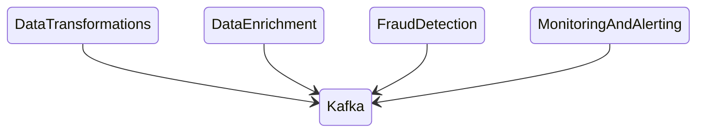
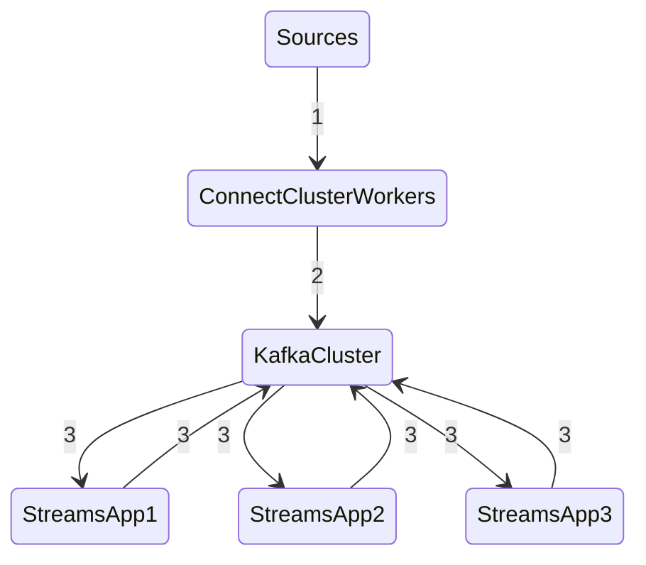

## What is Kafka Streams ? 

- Easy data processing and transformation library with in kafka.

- Standard Java Application
- No need to create a separate cluster
- Highly scalable, elastic and fault tolerant
- Exactly once Capabilities
- One record at a time processing (no batching).
- Works for any application size. 

## Kafka Streams Architecture Design: 

## Kafka Streams History: 

- This API/Library was introduced as part of Kafka 0.10 (2016).
    and is fully mature as part of Kafka 0.11.0.0 (June 2017)
- Its the only library at this time of writing that can leverage the 
 new exactly once capabilities from kafka 0.11.
- New library so prone to some changes in the future. 