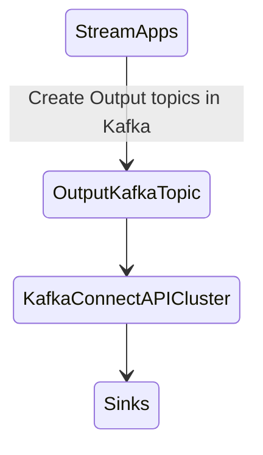

## Write To An External System: 

- The recommended way of doing so is Kafka Streams to transform the data and then using 
    ***Kafka Connect API***. 

```mermaid
stateDiagram
    StreamApps --> OutputKafkaTopic : Create Output topics in Kafka
    OutputKafkaTopic --> KafkaConnectAPICluster
    KafkaConnectAPICluster --> Sinks
```