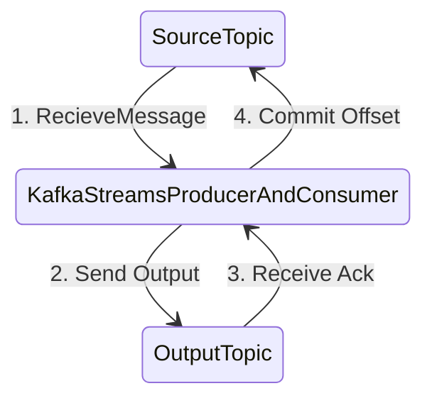

## Whats Exactly Once ? 

- Exactly once is the ability to guarantee that data processing on each message will happen only once
 and that pushing the message back to Kafka will also happen effectively only once (Kafka will de-dup)
- Guaranteed when both input and output system is Kafka, no for Kafka to any external systems.

### When does the problem arise ? 

***Problem1: If right after step3 application reboots.***

- As a Kafka Consumer (at least once): 
  - You receive twice the same message if the kafka broker reboots or your kafka consumer restarts.
  - This is because offsets are commited once in a while, but the data may have been processed already. 

***Problem2: If the n/w failure after step 2.***

- As a Kafka Producer: 
  - You send twice the same message to Kafka if you don't receive an ack back from Kafka (because of the retry logic).
  - But not receiving an ack does not mean Kafka hasn't received your message. It may mean that 
    the network just failed, instead of Kafka. 

## How does kafka solve the problem. 

- Its complex.
- Without getting in too much engineering detals: 
  - The producers are now idempotent (if the same message is sent twice ot more due to retries,
    Kafka will make sure to only keep one copy of it).
  - You can write multiple messages to different Kafka topics as part of one transaction.
    (either all are written, or none is written). This is a new advanced API. 

